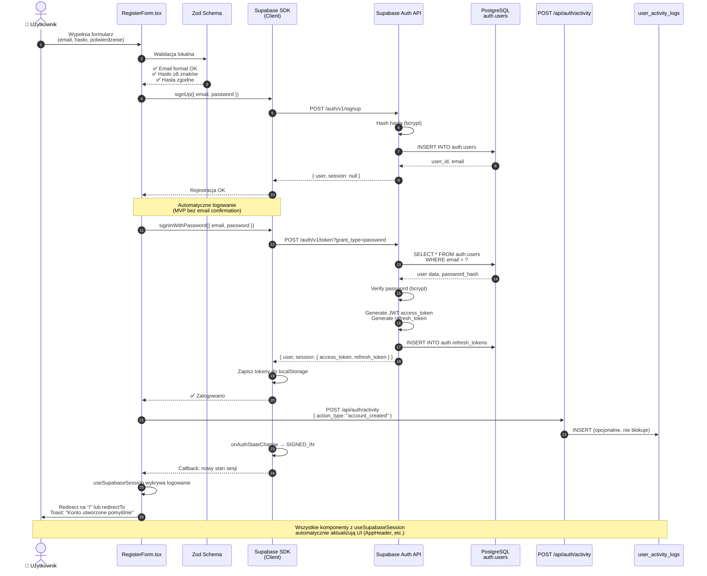
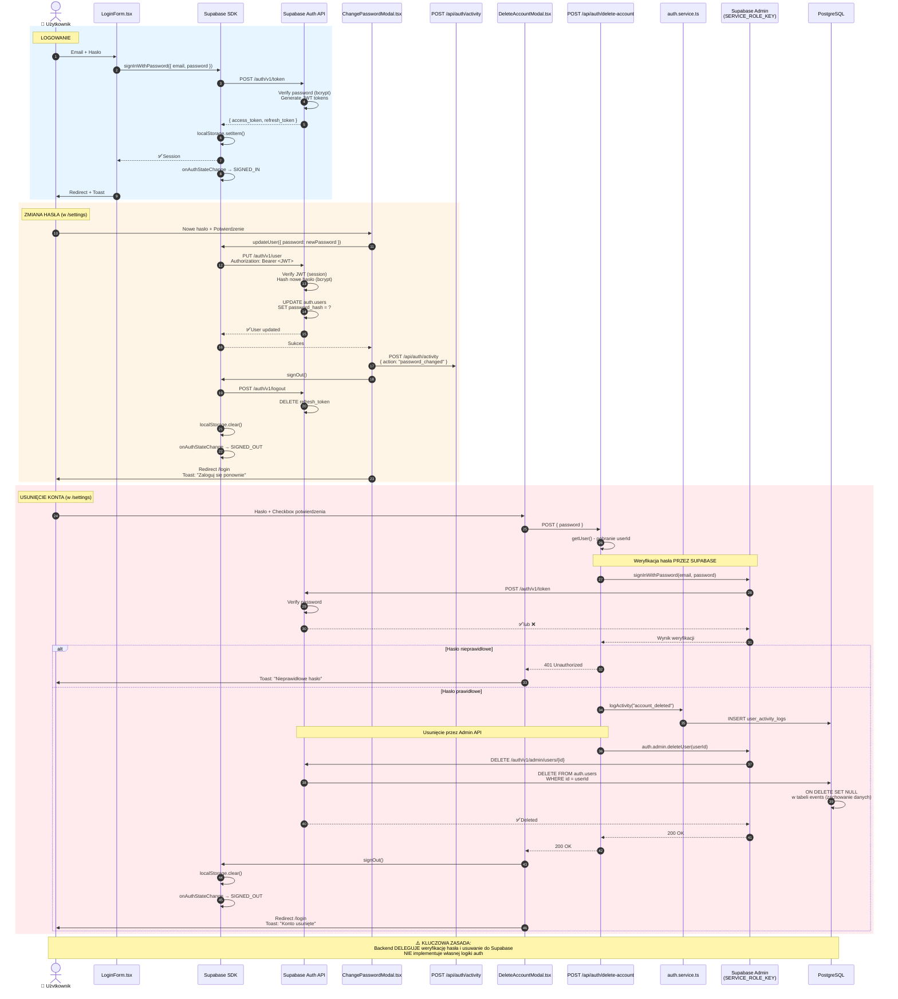

# Diagramy architektury autentykacji CulturAllyAI

> Diagramy ilustrujące przepływy autentykacji w aplikacji CulturAllyAI opartej na Supabase Auth.

## 1. Diagram komponentów i zależności

```mermaid
graph TB
    subgraph "Client (Browser)"
        subgraph "Astro Pages"
            LoginPage["🌐 /login<br/>login.astro"]
            RegisterPage["🌐 /register<br/>register.astro"]
            SettingsPage["🌐 /settings<br/>settings.astro<br/>(chroniony)"]
            EventsPage["🌐 /events<br/>events.astro<br/>(chroniony)"]
            GeneratorPage["🌐 /<br/>index.astro<br/>(publiczny)"]
        end
        
        subgraph "React Components - Auth"
            LoginForm["LoginForm.tsx<br/>signInWithPassword()"]
            RegisterForm["RegisterForm.tsx<br/>signUp() + signIn()"]
            AuthPageShell["AuthPageShell.tsx<br/>(wrapper)"]
            AuthErrorAlert["AuthErrorAlert.tsx<br/>(mapowanie błędów)"]
        end
        
        subgraph "React Components - Settings"
            ChangePasswordModal["ChangePasswordModal.tsx<br/>updateUser()"]
            DeleteAccountModal["DeleteAccountModal.tsx<br/>→ API endpoint"]
        end
        
        subgraph "React Components - Shared"
            AppHeader["AppHeader.tsx<br/>useSupabaseSession"]
            AuthPromptBanner["AuthPromptBanner.tsx"]
            GeneratorPageComp["GeneratorPage.tsx<br/>feature gating"]
        end
        
        subgraph "Custom Hooks"
            useSupabaseSession["useSupabaseSession<br/>onAuthStateChange()"]
            useAuthRedirect["useAuthRedirect<br/>(URLSearchParams)"]
        end
        
        subgraph "Supabase Client SDK"
            SupabaseClient["supabaseClient<br/>(ANON_KEY)"]
        end
    end
    
    subgraph "Server (Astro/Node)"
        subgraph "Middleware"
            AstroMiddleware["middleware/index.ts<br/>token z cookies → context.locals"]
        end
        
        subgraph "API Endpoints"
            AuthActivityAPI["POST /api/auth/activity<br/>(audit logs)"]
            DeleteAccountAPI["POST /api/auth/delete-account<br/>(Supabase Admin API)"]
        end
        
        subgraph "Services"
            AuthService["auth.service.ts<br/>(wrapper nad Admin API)"]
        end
        
        subgraph "Validators"
            AuthValidators["validators/auth.ts<br/>(Zod schemas)"]
        end
        
        subgraph "Supabase Admin"
            SupabaseAdmin["supabaseAdmin<br/>(SERVICE_ROLE_KEY)"]
        end
    end
    
    subgraph "Supabase Platform"
        SupabaseAuth["Supabase Auth API<br/>• signUp<br/>• signInWithPassword<br/>• signOut<br/>• updateUser<br/>• getUser (JWT verify)"]
        SupabaseDB["PostgreSQL<br/>• auth.users<br/>• user_activity_logs<br/>• events (RLS)"]
    end
    
    %% Client → Supabase direct connections
    LoginForm -->|"1. signInWithPassword()"| SupabaseClient
    RegisterForm -->|"1. signUp()<br/>2. signInWithPassword()"| SupabaseClient
    ChangePasswordModal -->|"updateUser({password})"| SupabaseClient
    AppHeader -->|"signOut()"| SupabaseClient
    GeneratorPageComp -->|"getSession()"| SupabaseClient
    
    SupabaseClient -->|"Auth API calls"| SupabaseAuth
    useSupabaseSession -->|"onAuthStateChange<br/>getSession()"| SupabaseClient
    
    %% Component relationships
    LoginPage -.->|"montuje"| LoginForm
    RegisterPage -.->|"montuje"| RegisterForm
    SettingsPage -.->|"montuje"| ChangePasswordModal
    SettingsPage -.->|"montuje"| DeleteAccountModal
    GeneratorPage -.->|"montuje"| GeneratorPageComp
    
    LoginForm -.->|"używa"| AuthPageShell
    RegisterForm -.->|"używa"| AuthPageShell
    LoginForm -.->|"używa"| AuthErrorAlert
    RegisterForm -.->|"używa"| AuthErrorAlert
    
    AppHeader -.->|"używa"| useSupabaseSession
    GeneratorPageComp -.->|"używa"| useSupabaseSession
    LoginForm -.->|"używa"| useAuthRedirect
    RegisterForm -.->|"używa"| useAuthRedirect
    
    %% SSR protection
    EventsPage -->|"getUser()"| AstroMiddleware
    SettingsPage -->|"getUser()"| AstroMiddleware
    AstroMiddleware -->|"weryfikacja JWT"| SupabaseAuth
    
    %% API calls
    DeleteAccountModal -->|"POST {password}"| DeleteAccountAPI
    LoginForm -->|"POST (audit)"| AuthActivityAPI
    RegisterForm -->|"POST (audit)"| AuthActivityAPI
    ChangePasswordModal -->|"POST (audit)"| AuthActivityAPI
    
    DeleteAccountAPI --> AuthService
    AuthActivityAPI --> AuthService
    AuthService -->|"admin.deleteUser()"| SupabaseAdmin
    AuthService -->|"signInWithPassword()<br/>(verify password)"| SupabaseAdmin
    
    SupabaseAdmin -->|"Admin API"| SupabaseAuth
    
    %% Validators
    LoginForm -.->|"validation"| AuthValidators
    RegisterForm -.->|"validation"| AuthValidators
    AuthActivityAPI -.->|"validation"| AuthValidators
    DeleteAccountAPI -.->|"validation"| AuthValidators
    
    %% Database
    SupabaseAuth -->|"CRUD<br/>auth.users"| SupabaseDB
    AuthService -->|"INSERT<br/>user_activity_logs"| SupabaseDB
    
    %% Styling
    classDef clientComponent fill:#e3f2fd,stroke:#1976d2,stroke-width:2px
    classDef serverComponent fill:#fff3e0,stroke:#f57c00,stroke-width:2px
    classDef supabaseComponent fill:#f3e5f5,stroke:#7b1fa2,stroke-width:2px
    classDef hookComponent fill:#e8f5e9,stroke:#388e3c,stroke-width:2px
    
    class LoginForm,RegisterForm,ChangePasswordModal,DeleteAccountModal,AppHeader,GeneratorPageComp,AuthPageShell,AuthErrorAlert,AuthPromptBanner clientComponent
    class AstroMiddleware,AuthActivityAPI,DeleteAccountAPI,AuthService,AuthValidators serverComponent
    class SupabaseClient,SupabaseAdmin,SupabaseAuth,SupabaseDB supabaseComponent
    class useSupabaseSession,useAuthRedirect hookComponent
```



## 2. Diagram sekwencji - Rejestracja i automatyczne logowanie



## 3. Diagram sekwencji - Logowanie, zmiana hasła i usunięcie konta



## Legendy i wyjaśnienia

### Kolory w diagramie komponentów:
- 🔵 **Niebieski** - Komponenty klienckie (React)
- 🟠 **Pomarańczowy** - Komponenty serwerowe (Astro/Node)
- 🟣 **Fioletowy** - Supabase (SDK, API, DB)
- 🟢 **Zielony** - Custom hooks

### Kluczowe punkty architektury:

1. **Single Source of Truth**: Supabase Auth zarządza całą logiką autentykacji
2. **Zero własnej implementacji**: Backend tylko deleguje do Supabase
3. **Client-side operations**: signUp, signIn, signOut, updateUser - wszystko przez SDK
4. **Server-side tylko dla Admin API**: deleteUser wymaga service role key
5. **Weryfikacja JWT**: Zawsze przez `supabase.auth.getUser()`, nigdy własna implementacja
6. **Audyt**: `user_activity_logs` zapisywane przez backend z service role key (bypass RLS)

### Przepływy sesji:

```
Rejestracja:  signUp() → signInWithPassword() → localStorage → onAuthStateChange
Logowanie:    signInWithPassword() → localStorage → onAuthStateChange  
Wylogowanie:  signOut() → localStorage.clear() → onAuthStateChange
Zmiana hasła: updateUser() → signOut() (wymuś ponowne logowanie)
Usunięcie:    Backend verify password → admin.deleteUser() → signOut()
```

### Ochrona tras:

```typescript
// SSR Protection (Astro)
const { data: { user }, error } = await context.locals.supabase.auth.getUser();
if (!user || error) return Astro.redirect('/login?redirect=...');

// Client-side Protection (React)
const { isAuthenticated } = useSupabaseSession(supabase);
if (!isAuthenticated) return <AuthPromptBanner />;
```
