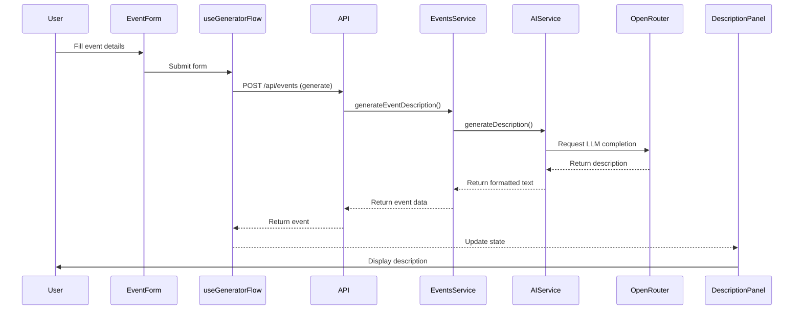

# UI Architecture Diagram

This diagram shows the UI component architecture of CulturAllyAI following the C4 model approach.

```mermaid
graph TB
    subgraph Browser["Browser Context"]
        subgraph AstroPages["Astro Pages (SSR)"]
            IndexPage["index.astro<br/>Generator View"]
            LayoutComp["Layout.astro<br/>Global Layout"]
        end

        subgraph ReactComponents["React Components (Client-Side)"]
            subgraph FeatureComponents["Feature Components"]
                GeneratorPage["GeneratorPage<br/>Main Container"]
                EventForm["EventForm<br/>Input Form"]
                DescriptionPanel["DescriptionPanel<br/>Output Display"]
                ActionButtons["ActionButtons<br/>Save/Regenerate"]
                RatingButtons["RatingButtons<br/>Rate Description"]
                DescriptionPreview["DescriptionPreview<br/>Markdown Render"]
                CharacterCounter["CharacterCounter<br/>Input Validation"]
                TimeoutNotice["TimeoutNotice<br/>Error Display"]
            end

            subgraph GlobalComponents["Global Components"]
                AppHeader["AppHeader<br/>Auth + Navigation"]
                Header["Header<br/>Branding"]
                ThemeToggle["ThemeToggle<br/>Dark/Light Mode"]
                AuthPromptBanner["AuthPromptBanner<br/>Guest CTA"]
            end

            subgraph UIComponents["UI Primitives (Shadcn/ui)"]
                Button["Button"]
                Input["Input"]
                Textarea["Textarea"]
                Select["Select"]
                Alert["Alert"]
                Tooltip["Tooltip"]
                Skeleton["Skeleton"]
            end
        end

        subgraph ReactHooks["React Hooks (State)"]
            useSupabaseSession["useSupabaseSession<br/>Auth State Monitor"]
            useGeneratorFlow["useGeneratorFlow<br/>API Mutations"]
            useEventForm["useEventForm<br/>Form State"]
            useTheme["useTheme<br/>Theme State"]
        end
    end

    subgraph ServerContext["Server Context"]
        Middleware["Middleware<br/>Token Extraction"]

        subgraph APIEndpoints["API Endpoints"]
            EventsAPI["POST /api/events<br/>GET /api/events"]
            EventByIdAPI["PATCH /api/events/[id]<br/>DELETE /api/events/[id]"]
            CategoriesAPI["GET /api/categories/events<br/>GET /api/categories/age"]
        end

        subgraph Services["Services"]
            EventsService["events.service.ts<br/>CRUD Logic"]
            CategoriesService["categories.service.ts<br/>Categories Logic"]
            AIService["openrouter.service.ts<br/>AI Generation"]
        end
    end

    subgraph ExternalServices["External Services"]
        SupabaseAuth["Supabase Auth<br/>JWT Verification"]
        SupabaseDB["Supabase DB<br/>PostgreSQL"]
        OpenRouter["OpenRouter API<br/>LLM Provider"]
    end

    %% Page to Component Relationships
    IndexPage --> |"renders"| LayoutComp
    LayoutComp --> |"includes"| AppHeader
    LayoutComp --> |"renders"| GeneratorPage

    %% Component Hierarchy
    GeneratorPage --> |"contains"| EventForm
    GeneratorPage --> |"contains"| DescriptionPanel
    GeneratorPage --> |"contains"| AuthPromptBanner

    EventForm --> |"contains"| Input
    EventForm --> |"contains"| Textarea
    EventForm --> |"contains"| Select
    EventForm --> |"contains"| CharacterCounter
    EventForm --> |"uses"| Button

    DescriptionPanel --> |"contains"| DescriptionPreview
    DescriptionPanel --> |"contains"| ActionButtons
    DescriptionPanel --> |"contains"| RatingButtons
    DescriptionPanel --> |"contains"| TimeoutNotice

    ActionButtons --> |"uses"| Button
    ActionButtons --> |"uses"| Tooltip
    RatingButtons --> |"uses"| Button

    AppHeader --> |"includes"| Header
    AppHeader --> |"includes"| ThemeToggle
    AppHeader --> |"uses"| Button

    AuthPromptBanner --> |"uses"| Alert
    TimeoutNotice --> |"uses"| Alert
    DescriptionPreview --> |"uses"| Skeleton

    %% Hook Dependencies
    GeneratorPage -.-> |"uses"| useSupabaseSession
    GeneratorPage -.-> |"uses"| useGeneratorFlow
    GeneratorPage -.-> |"uses"| useEventForm
    AppHeader -.-> |"uses"| useSupabaseSession
    ThemeToggle -.-> |"uses"| useTheme

    %% Hook to Service Connections
    useSupabaseSession -.-> |"monitors"| SupabaseAuth
    useGeneratorFlow -.-> |"calls"| EventsAPI
    useGeneratorFlow -.-> |"calls"| EventByIdAPI
    useEventForm -.-> |"calls"| CategoriesAPI

    %% API to Service Relationships
    EventsAPI --> |"uses"| EventsService
    EventByIdAPI --> |"uses"| EventsService
    CategoriesAPI --> |"uses"| CategoriesService

    EventsAPI --> |"passes through"| Middleware
    EventByIdAPI --> |"protected by"| Middleware

    %% Service to External Relationships
    Middleware -.-> |"verifies token"| SupabaseAuth
    EventsService --> |"queries"| SupabaseDB
    EventsService --> |"generates via"| AIService
    CategoriesService --> |"queries"| SupabaseDB
    AIService --> |"requests"| OpenRouter

    %% Styling
    classDef astroStyle fill:#ff5a1f,stroke:#333,stroke-width:2px,color:#fff
    classDef reactStyle fill:#61dafb,stroke:#333,stroke-width:2px,color:#000
    classDef hookStyle fill:#764abc,stroke:#333,stroke-width:2px,color:#fff
    classDef serverStyle fill:#68a063,stroke:#333,stroke-width:2px,color:#fff
    classDef externalStyle fill:#f39c12,stroke:#333,stroke-width:2px,color:#fff
    classDef uiStyle fill:#9b59b6,stroke:#333,stroke-width:2px,color:#fff

    class IndexPage,LayoutComp astroStyle
    class GeneratorPage,EventForm,DescriptionPanel,ActionButtons,RatingButtons,DescriptionPreview,CharacterCounter,TimeoutNotice,AppHeader,Header,ThemeToggle,AuthPromptBanner reactStyle
    class Button,Input,Textarea,Select,Alert,Tooltip,Skeleton uiStyle
    class useSupabaseSession,useGeneratorFlow,useEventForm,useTheme hookStyle
    class Middleware,EventsAPI,EventByIdAPI,CategoriesAPI,EventsService,CategoriesService,AIService serverStyle
    class SupabaseAuth,SupabaseDB,OpenRouter externalStyle
```



## Architecture Layers

### 1. Presentation Layer (Browser Context)

- **Astro Pages**: SSR entry points (index.astro, Layout.astro)
- **React Components**: Client-side interactive components
  - Feature Components: Generator-specific functionality
  - Global Components: Shared across all pages (header, navigation, auth)
  - UI Primitives: Shadcn/ui reusable components
- **React Hooks**: State management and side effects

### 2. Server Layer (Server Context)

- **Middleware**: Token extraction and Supabase client injection
- **API Endpoints**: RESTful endpoints for events and categories
- **Services**: Business logic layer (CRUD, AI generation)

### 3. External Services

- **Supabase Auth**: JWT-based authentication
- **Supabase DB**: PostgreSQL database
- **OpenRouter API**: LLM provider for description generation

## Authentication Boundaries

### Guest Features (Public)

- EventForm: Input form for event details
- GeneratorPage: Generate description (anonymous)
- DescriptionPanel: View generated description
- AuthPromptBanner: Prompt to login/register

### Authenticated Features (Protected)

- ActionButtons: Save event (requires auth)
- RatingButtons: Rate description (requires auth)
- AppHeader: Shows user session + sign out
- PATCH/DELETE /api/events/[id]: Modify/delete own events

## Data Flow



## Component Relationships

### GeneratorPage Composition

```
GeneratorPage
├── useSupabaseSession (auth state)
├── useGeneratorFlow (API mutations)
├── useEventForm (form state)
├── EventForm
│   ├── Input (name, location, date)
│   ├── Textarea (description)
│   ├── Select (categories)
│   ├── CharacterCounter
│   └── Button (generate)
├── DescriptionPanel
│   ├── DescriptionPreview (markdown)
│   ├── ActionButtons (save, regenerate)
│   ├── RatingButtons (like, dislike)
│   └── TimeoutNotice (error state)
└── AuthPromptBanner (if guest)
```

### AppHeader Composition

```
AppHeader
├── useSupabaseSession (auth state)
├── Header (branding)
├── ThemeToggle (dark/light)
└── Button (sign out)
```

## Notes

1. **Hydration Strategy**: Only GeneratorPage uses `client:load` directive (from index.astro), all child components are automatically hydrated.

2. **State Management**: No global state library (Redux/Zustand) - uses React hooks for local state and Supabase client for server state.

3. **Styling**: Tailwind 4 with Shadcn/ui primitives, theme managed by useTheme hook (localStorage persistence).

4. **Missing Components** (planned per auth-spec.md):
   - Login/Register pages (login.astro, register.astro)
   - Settings page (settings.astro)
   - Events list page (events.astro)
   - Auth forms (LoginForm, RegisterForm)
   - Settings modals (ChangePasswordModal, DeleteAccountModal)

5. **API Protection**: Middleware extracts Bearer token, protected endpoints (PATCH/DELETE) require valid JWT, public endpoints (POST generate, GET events) are optional auth.
