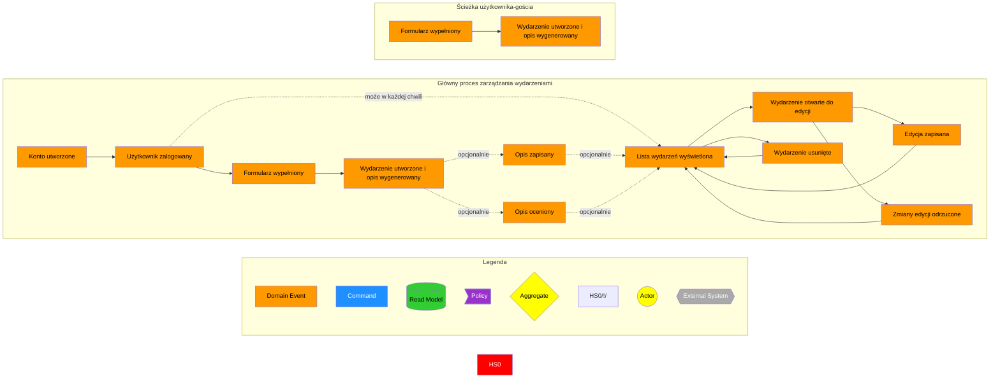

```mermaid
flowchart LR
subgraph Legenda
  DE0[Domain Event]
  CMD0[Command]
  RM0[(Read Model)]
  POL0>Policy]
  AGG0{Aggregate}
  HS0/!/
  ACT0((Actor))
  EX0{{External System}}

  style DE0 fill:#FF9900,color:black
  style CMD0 fill:#1E90FF,color:white
  style RM0 fill:#32CD32,color:black
  style POL0 fill:#9932CC,color:white
  style AGG0 fill:#FFFF00,color:black
  style HS0 fill:#FF0000,color:white
  style ACT0 fill:#FFFF00,color:black
  style EX0 fill:#A9A9A9,color:white
end

subgraph Proces_Glowny [Główny proces zarządzania wydarzeniami]
  direction LR
  
  DE1[Konto utworzone]
  DE2[Użytkownik zalogowany]
  DE3[Formularz wypełniony]
  DE4[Wydarzenie utworzone i opis wygenerowany]
  DE5[Opis zapisany]
  DE6[Opis oceniony]
  DE7[Lista wydarzeń wyświetlona]
  DE8[Wydarzenie otwarte do edycji]
  DE9[Edycja zapisana]
  DE10[Zmiany edycji odrzucone]
  DE11[Wydarzenie usunięte]

  DE1 --> DE2
  DE2 --> DE3
  DE2 -.->|może w każdej chwili| DE7
  DE3 --> DE4
  DE4 -.->|opcjonalnie| DE5
  DE4 -.->|opcjonalnie| DE6
  DE5 -.->|opcjonalnie| DE7
  DE6 -.->|opcjonalnie| DE7
  DE7 --> DE8
  DE7 --> DE11
  DE8 --> DE9
  DE8 --> DE10
  DE9 --> DE7
  DE10 --> DE7
  DE11 --> DE7

  style DE1 fill:#FF9900,color:black
  style DE2 fill:#FF9900,color:black
  style DE3 fill:#FF9900,color:black
  style DE4 fill:#FF9900,color:black
  style DE5 fill:#FF9900,color:black
  style DE6 fill:#FF9900,color:black
  style DE7 fill:#FF9900,color:black
  style DE8 fill:#FF9900,color:black
  style DE9 fill:#FF9900,color:black
  style DE10 fill:#FF9900,color:black
  style DE11 fill:#FF9900,color:black
end

subgraph Sciezka_Goscia [Ścieżka użytkownika-gościa]
  direction LR
  
  DE12[Formularz wypełniony]
  DE13[Wydarzenie utworzone i opis wygenerowany]

  DE12 --> DE13

  style DE12 fill:#FF9900,color:black
  style DE13 fill:#FF9900,color:black
end
```